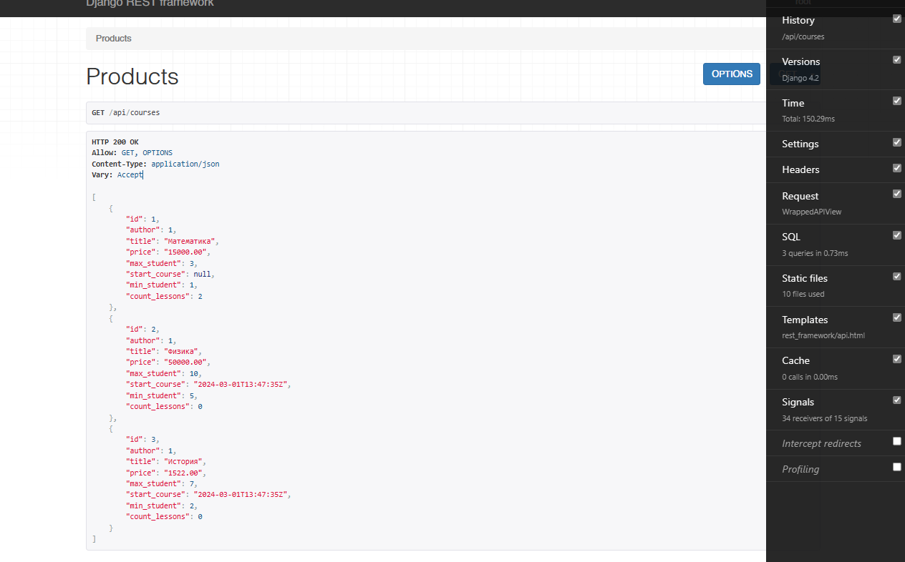
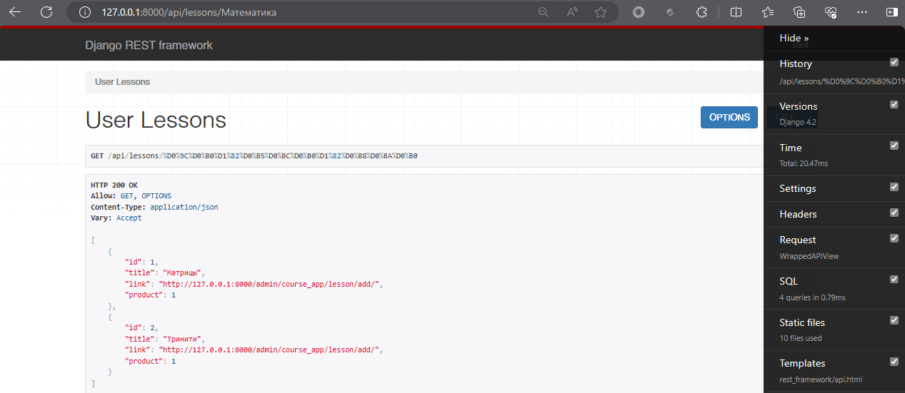
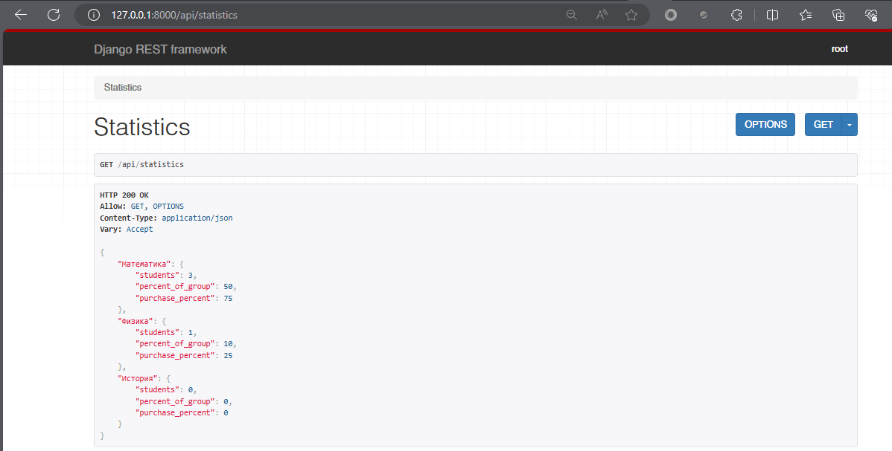

### Архитектура
Приложение `course_app` включает следующие модели 
1. Product
2. Lesson
3. Group
4. Access_Product

- Первые три базовые по заданию, `Access_Product` для предоставления доступа пользователю к курсу
- Пользователь получает доступ к продукту в админке
- Далее идет распределение пользователя в группу с учетом минимального и максимального количества пользователей в группе
- Сперва заполняет все группы до минимальных величин, поочередно, затем идет равномерное распределение между группами
  (продукту ведь не нужны не заполненные до минимума кучи групп)


### API 
1. Получение списка всех продуктов с количеством уроков у каждого

```
http://127.0.0.1:8000/api/courses
```


2. Получение всех уроков пользователя по определенному предмету
```
http://127.0.0.1:8000/api/lessons/Математика
```


3. Получение статистики по всем продуктам
```
http://127.0.0.1:8000/api/statistics
```


### Запуск приложения

```bash
./manage.py runserver
./manage.py createsuperuser
```

Сделана ли оптимизация запросов в БД? Вопрос хороший
